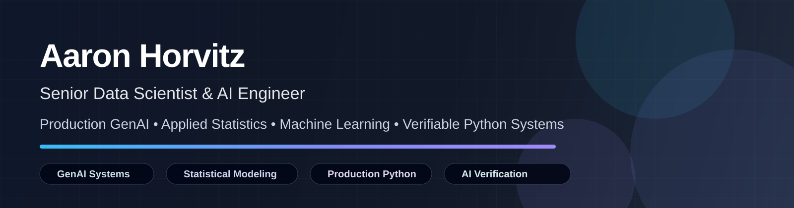

## Featured Portfolio Projects

| Project | Focus | Technical Highlights |
|---|---|---|
| [CodingMage](https://github.com/AaronNHorvitz/CodingMage) | Multi-agent engineering coordinator | Multi-agent coding tool: AI agents take team-lead and senior-reviewer roles over isolated implementation pods, with deny-first permissions, deterministic review gates, and restart-safe long-running campaigns |
| [Agent Gatsby](https://github.com/AaronNHorvitz/Agent-Gatsby) | Local-first GenAI pipeline | Deterministic state machine, quote verification, bounded expansion loops, hallucination control, multilingual output |
| [Labels On Tap](https://github.com/AaronNHorvitz/Labels-On-Tap) | AI verification & compliance | Local-first ML compliance engine using OCR/NLP, deterministic matching, FastAPI, Docker, and human-in-the-loop review |
| [LexiChess](https://github.com/AaronNHorvitz/LexiChess) | LLM/agent benchmarking | Reproducible chess-agent evaluation with legal-move validation, SQLite storage, ratings, PGN exports, and live broadcast tooling |
| [TopicMiner](https://github.com/AaronNHorvitz/TopicMiner) | Deterministic NLP classification | Classical NLP and ML toolkit for high-volume, auditable email classification and topic discovery |
| [AdaptiveLASSO](https://github.com/AaronNHorvitz/AdaptiveLASSO) | Statistical computing | Python package implementing adaptive LASSO with a Statsmodels-style workflow, tests, documentation, and demo notebook |
| [iSignify](https://github.com/AaronNHorvitz/iSignify) | Bioinformatics & private AI | Local/on-device AI interpretation with custom k-mer comparison for genomic signature discovery |
| [USTE](https://github.com/AaronNHorvitz/USTE) | Universal Spatial-Temporal Engine | A deterministic simulation kernel in Rust that renders an entire universe from a seed, a rulebook, and a clock — event-sourced and fully replayable, computing only the present moment and storing only what deviates, across scales from human to astronomical |

---

## Project Portfolio Narrative

### CodingMage

A local multi-agent engineering coordinator that turns a suite of AI models into a development team with a chain of command: a lead that plans and assigns bounded work, isolated pods that implement, and an independent senior reviewer that signs off on the exact commit before integration. The coordinator is the only Git, merge, and credential authority, so long roadmaps run end to end without a human refereeing every step and without any agent acting on the outside world alone.

**Key themes:** multi-agent orchestration, verified results per token, deny-first permissions, deterministic review gates, restart-safe long builds.

### Agent Gatsby

A local-first AI pipeline built around deterministic workflow control. The project demonstrates how GenAI systems can be constrained, verified, and structured to reduce hallucination risk while still producing useful multilingual output.

**Key themes:** GenAI orchestration, deterministic verification, quote validation, local-first AI, bounded generation loops.

### Labels On Tap

A local-first AI verification and compliance system that combines deterministic string matching, OCR/NLP, and human-in-the-loop review. The project demonstrates how AI can assist regulatory triage while preserving auditability.

**Key themes:** compliance automation, OCR/NLP, FastAPI, Docker, deterministic matching, human review.

### LexiChess

A chess tournament and evaluation platform for benchmarking LLMs, chess agents, and custom engines. The project emphasizes reproducibility, legal-move validation, rating updates, persistent storage, and live interaction.

**Key themes:** LLM evaluation, agent benchmarking, SQLite, FastAPI, PGN exports, live broadcast tooling.

### TopicMiner

A modular Python toolkit for deterministic, high-volume email classification using classical NLP and machine learning methods. It is designed as an auditable alternative to LLM-based classification for narrow-taxonomy tasks.

**Key themes:** LDA, Word2Vec, Doc2Vec, K-Means, Random Forest, XGBoost, deterministic NLP.

### AdaptiveLASSO

A statistical computing project implementing adaptive LASSO in Python with a clean workflow inspired by Statsmodels. The project shows applied statistical modeling, packaging, testing, documentation, and reproducibility.

**Key themes:** regression, shrinkage, statistical computing, Python packaging, reproducible modeling.

### iSignify

A bioinformatics and AI pipeline focused on local/on-device interpretation and custom k-mer comparison for identifying unique genomic signatures across large datasets.

**Key themes:** private AI, bioinformatics, k-mer algorithms, local inference, computational efficiency.

### USTE — Universal Spatial-Temporal Engine

A deterministic, multiscale, event-sourced simulation kernel in Rust. It represents an entire universe as a seed, a rulebook, and a clock: compute only what matters at the present moment, store only what deviates from the rules, and replay any moment exactly. The founding trick of Elite and Starflight, rebuilt for modern hardware.

**Key themes:** deterministic simulation, event sourcing, procedural generation, Rust, replay verification, multiscale coordinates.

## Professional Background Snapshot

### IT Specialist (Artificial Intelligence), GS-15 — U.S. Department of the Treasury

AI engineering for Treasury business units.

### Gen AI Python Systems Engineer — PwC Advisory Services

Contributed to production-grade Generative AI systems and built modular Python pipeline components for enterprise AI delivery, including object-oriented pipeline architecture, complex data ingestion, Pydantic validation, unit testing, and peer-reviewed code delivery.

### Statistician / Data Scientist, GS-14 — IRS Research, Analytics, and Applied Statistics

Led and supported projects involving LLM/RAG interfaces, email classification, audit automation, executive briefings, forecasting, and Python ETL systems.

This work combined statistical modeling, automation, technical leadership, and communication with senior federal stakeholders.

### Data Scientist — McDermott International

Built forecasting systems, workforce planning models, Python statistical tooling, and automated executive reporting workflows.

Work included time-series forecasting, statistical learning, internal Python tool development, and applied statistics training.

### Data Scientist — Avangard Innovative

Developed computer vision models, real-time predictive modeling systems, API normalization workflows, and statistical process analysis tools.

Work included CNN image classification, sensor-data modeling, API-driven normalization, ANOVA/Tukey testing, SQL, and time-series forecasting.

---

## Technical Stack

### Languages & Core Tools

Python · SQL · Linux · GitHub · GitLab · VS Code · JupyterLab

### Data Science & Machine Learning

Pandas · NumPy · Scikit-Learn · Statsmodels · PyTorch · XGBoost · Random Forests · LDA · Word2Vec · Doc2Vec

### GenAI & Engineering

LLMs · RAG · Agentic Workflows · FastAPI · Docker · Pydantic · SQLite · Local-First AI · Human-in-the-Loop Review

### Statistical Methods

Time Series · SARIMAX · LOWESS · Regression · Classification · Multivariate Analysis · Forecasting · Shrinkage Methods

### Engineering Practices

Unit Testing · Code Review · Modular Architecture · ETL Automation · Data Validation · Reproducible Workflows · Documentation

---

## Portfolio Principles

I am especially interested in AI and data systems that are:

- **Useful in real operational settings**
- **Reviewable and explainable**
- **Reliable under messy real-world data**
- **Statistically defensible**
- **Testable and maintainable**
- **Production-ready rather than demo-only**

My preferred approach is pragmatic: use GenAI where it adds value, use classical ML where it is stronger, and use deterministic validation wherever reliability matters.

---

## Connect

Please use the contact and social links in my GitHub profile sidebar.

GitHub: [github.com/AaronNHorvitz](https://github.com/AaronNHorvitz)

LinkedIn: [linkedin.com/in/aaron-horvitz-a666215](https://www.linkedin.com/in/aaron-horvitz-a666215)

Resume: [Download Resume](./assets/Aaron-Horvitz-Resume.pdf)
